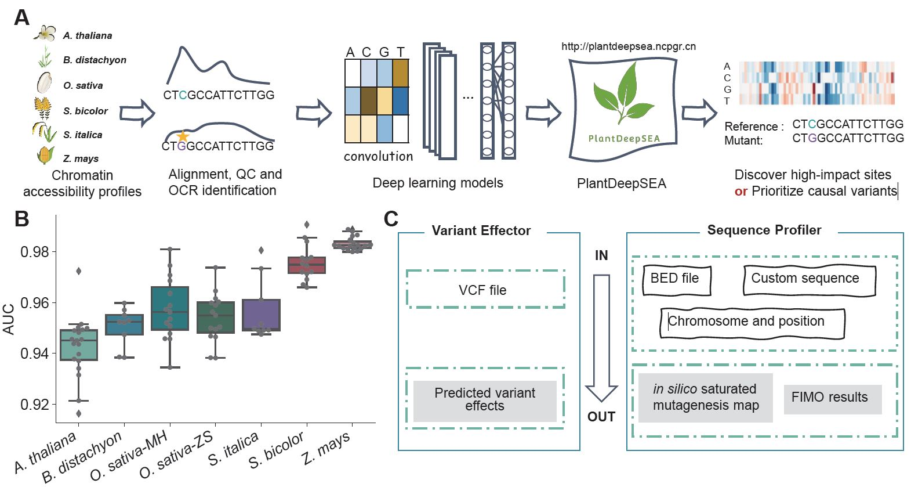
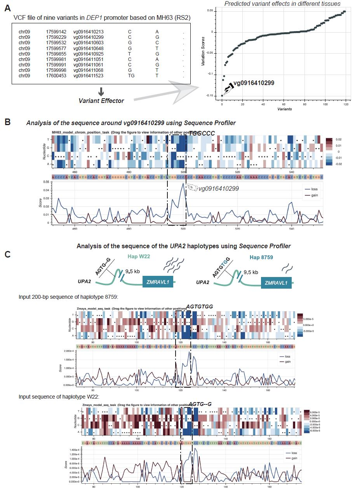

---

[PlantDeepSEA](http://plantdeepsea.ncpgr.cn/) is a webserver based on deep learning models of chromatin accessibility for multiple plant species. It can predict the impact of genomic variants on chromatin accessibility in multiple tissues. Therefore, it can be used to prioritize genomic variants and discover high-impact cis-regulatory sites within a sequence. PlantDeepSEA is freely accessible for all users.

## Citation

Hu Zhao#, Zhuo Tu#, Yinmeng Liu, Zhanxiang Zong, Jiacheng Li, Hao Liu, Feng Xiong, Jinling Zhan, Xuehai Hu, and Weibo Xie* (2021). PlantDeepSEA, a deep learning-based web service to predict the regulatory effects of genomic variants in plants. *Nucleic Acids Research*, doi: 10.1093/nar/gkab383

## Overview of PlantDeepSEA

(A) Workflow of PlantDeepSEA. Firstly, we collected high-quality chromatin accessibility data from multiple representative tissues of six plant species. Secondly, we obtained credible open chromatin regions (OCRs) for each species through sequence alignment, quality control (QC), and OCR identification steps. Thirdly, we implemented a high-performance deep learning model, [DeepSEA](https://doi.org/10.1038/nmeth.3547) using the [Selene](https://github.com/FunctionLab/selene) SDK, and used chromatin accessibility data to train the model. Fourthly, we built PlantDeepSEA based on tools such as Django and bokeh. PlantDeepSEA can be used to identify high-impact sites or prioritize causal variants.

(B) Boxplot of area under curve (AUC) in each deep neural network model. Each point represents the corresponding AUC of each sample.

(C) Two main functions in PlantDeepSEA. We designed two tools named *Variant Effector* and *Sequence Profiler*, the accepted inputs and outputs are listed in the plot.

## Case Studies

(A) Prioritization of causal variants in *DEP1* promoter region. We made the VCF file of nine variants in *DEP1* promoter region and used the tool *Variant Effector* to prioritize these variants. The result showed that vg0916410299 was ranked as the most likely causal variant among the provided variants.

(B) Analysis of high impact sites around the SNP vg0916410299. We used the tool *Sequence Profiler* by entering the chromosome and the position of vg0916410299. The *in silico* saturated mutagenesis map showed sequence TGGCCC (overlapped with vg0916410299) might be a *cis*-regulatory element.

(C) Analysis of high impact sites for different haplotypes of QTL *UPA2* using the tool *Sequence Profiler*. The *in silico* saturated mutagenesis map of CIMMYT 8759 haplotype (upper) and W22 haplotype (under) showed the sequence AGTGTG might be a *cis*-regulatory element, which is consistent with the results of previous report. The loss score refers to the maximum decrease in probability that an allele belongs to open chromatin compared to the reference nucleotide in all mutations at each site. And the gain score refers to the maximum increase.

## Documentation

The documentation for PlantDeepSEA is available [here](https://plantdeepsea-toturial2.readthedocs.io/en/latest/).